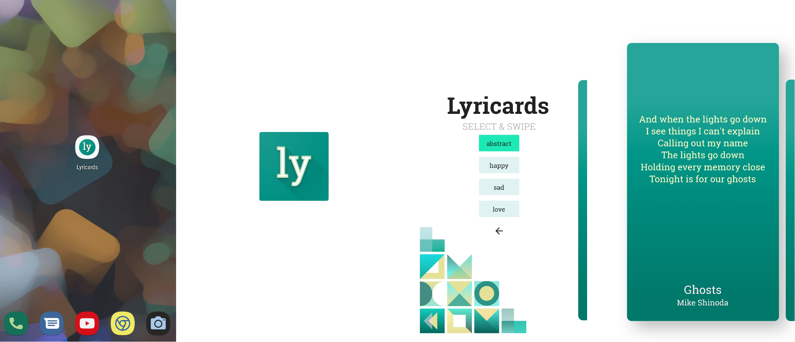

# Lyricards

A fluid card based application for getting beautiful lyrics everyday

## Documentation

This showcase application is built with Flutter utilizing Flutter's various useful widgets and features. The application shows short snippets of song lyrics in card views. The lyrics are also categorized using vibe tags and users can select a tag from the home screen to view lyrics of that particular vibe. 
The cards contain fluid animation which creates a satisfying motion while swapping. Users can also copy the lyrics from the cards. The backend database is developed using Firebase.

## Features

- Get beautiful lyrics snippets everyday
- Get notification when a new lyric is posted
- Select a vibe from the home page to find lyrics of your choice
- Tap and hold the card to copy the lyrics to clipboard

## Demo

